  

 

  
  
  

## 👋 About me

I'm **Samuel Sukarno**, a Front-End Engineer based in **Jakarta** who turns ambitious ideas into fast, polished, and delightful web experiences.

- ⚡ Building responsive interfaces with thoughtful motion
- 🎨 Obsessed with the details between design and code
- 🧩 Creating reusable components and scalable design systems
- 🌱 Always learning, always shipping

## 🛠️ Front-end toolbox

  

## 📊 GitHub activity

  
  

## 🌐 Let's build something memorable

  <a href="mailto:sukarnosamuel1@gmail.com"><strong>sukarnosamuel1@gmail.com</strong></a>
  &nbsp;•&nbsp;
  <a href="https://github.com/FanSems1"><strong>@FanSems1</strong></a>
  &nbsp;•&nbsp;
  <strong>Jakarta, Indonesia</strong>

  Crafted with curiosity, caffeine, and a suspicious number of browser tabs.

